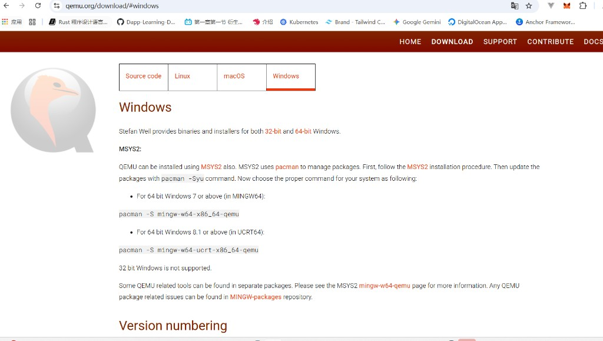
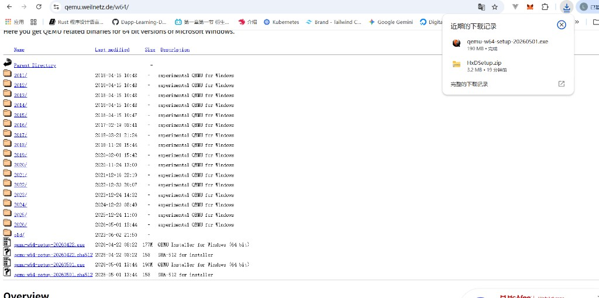
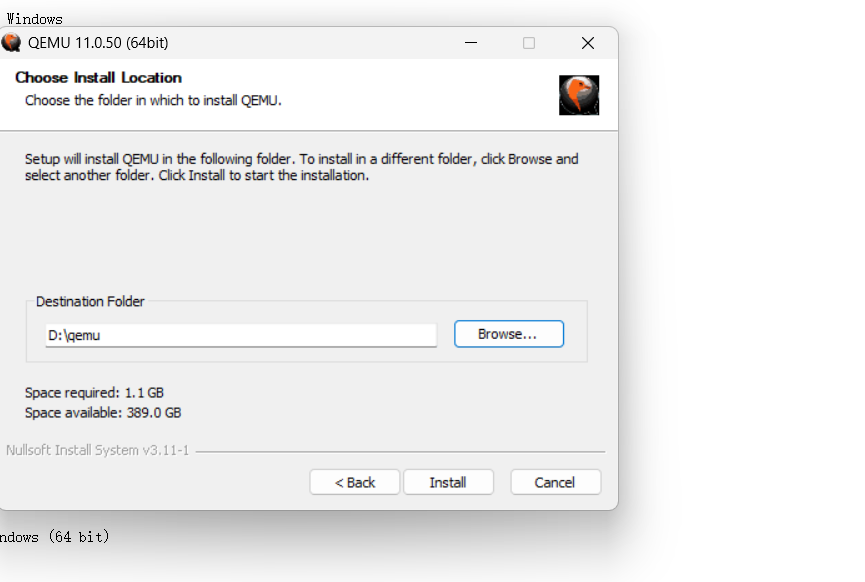

# Day 0 · Windows + QEMU 环境部署

> **目标：** 用 **NASM + GCC + Make + QEMU** 跑通 Day 1 的 `helloos.img`（不必安装原书 tolset；见 [TOOLCHAIN.md](./TOOLCHAIN.md)）。

---

## 1. 你需要什么

| 组件 | 作用 | 典型文件名 |
|------|------|------------|
| **HxD** | Day 1 手工写软盘映像（可先于 tolset） | `HxD.exe` — 见 [day-01 section 1.1](./day-01-boot-asm/notes/section-1.1-先动手操作.md) |
| **NASM** | **全程核心汇编器** | `nasm.exe` — **安装见 [day-01 §1.3](./day-01-boot-asm/notes/section-1.3-初次体验汇编程序.md#安装-nasm)** |
| **GCC** | C 内核与应用程序（替代 tolset **bcc**） | MinGW-w64 / MSYS2 的 `gcc.exe` |
| **映像工具** | 把 `ipl.bin` 写入软盘映像 | `edimg` / `imgtool` / 书内脚本 |
| **QEMU** | 加载 `.img` 模拟 x86 PC 启动 | `qemu-system-i386.exe` |
| **Make** | 驱动 Makefile | `make.exe`（tolset 常自带或需单独装） |
| **每日源码** | Day 1–30 工程 | 各 `day-XX-slug/code/` 或本机 `proj/` |

**获取方式：** NASM / GCC / QEMU / Make 均为开源工具，按下方步骤安装即可。原书 **tolset** 仅作对照可选，**本仓库不托管** 版权资源。

**工具链说明：** [TOOLCHAIN.md](./TOOLCHAIN.md) — NASM 工具链。

---

## 2. 目录规划（强制规范）

```
C:\dev\haribote\          ← 推荐：纯英文、无空格
├── tools\                ← 可选：统一放 nasm / gcc / make（或依赖 MSYS2 PATH）
├── qemu\                 ← qemu-system-i386.exe
└── proj\                 ← 每日工程（对应本仓库各 day-XX-slug/code/）
    ├── day-01\
    ├── day-02\
    └── ...
```

**禁止：** 路径含 **中文**、**空格** — 部分批处理与链接脚本对非 ASCII 路径敏感。

**本仓库建议：** 实验代码放在对应 Day 目录下 `code/`（如 [day-01-boot-asm/code/](./day-01-boot-asm/code/)），路径同样遵守上述规则。

---

## 3. 配置步骤

### 3.1 安装 NASM

**完整图文步骤在 Day 1 本节 — 跟书走到汇编时再装即可：**

→ [day-01 section 1.3 · 安装 NASM](./day-01-boot-asm/notes/section-1.3-初次体验汇编程序.md#安装-nasm)

装完验证：`nasm -v` · 编译：`nasm -f bin helloos.asm -o helloos.img`

### 3.2 安装 GCC 与 Make

推荐 [MSYS2](https://www.msys2.org/) → `pacman -S mingw-w64-x86_64-gcc make`

```cmd
gcc --version
make --version
```

### 3.3 安装 QEMU（官方 `qemu-w64-setup`）

**Day 1 手工 `boot.img`：** 只需 QEMU，**不必** VMware / VirtualBox。详见 [day-01 section 1.1.5](./day-01-boot-asm/notes/section-1.1.5-QEMU安装与运行.md)。



1. [qemu.org/download#windows](https://www.qemu.org/download/#windows) → **Windows** 标签
2. **Stefan Weil provides binaries…** → 点 **`64-bit`** → [qemu.weilnetz.de/w64/](https://qemu.weilnetz.de/w64/)



3. 下载列表底部最新 **`qemu-w64-setup-YYYYMMDD.exe`**（例：`qemu-w64-setup-20230501.exe`）
4. 双击安装包 → **Choose Install Location** → **`D:\qemu`**（或 `D:\DevTools\QEMU`）→ **Install**（约 1.1 GB）



5. 勾选 **PATH**（若有）→ 完成 → 新开 cmd：`qemu-system-i386 --version`

> **跳过 MSYS2 / pacman** 段落 — 仅开发编译用；学习用书用 **setup 安装包** 即可。

| 备选 | 说明 |
|------|------|
| **tolset 自带** | 若已装原书包，可用其 QEMU；与本仓库 NASM 链 **独立** |

> 避免使用非官方的「QEMU 便携版」第三方整合包；**`qemu-w64-setup`** 即官网推荐的 Windows 安装方式。

**Day 1 一行启动（软盘映像）：**

```cmd
cd <boot.img 所在目录>
qemu-system-i386 -fda boot.img -boot a
```

### 3.4 配置 PATH（二选一）

**A. 临时（当前 cmd 窗口）：**

```cmd
set PATH=D:\qemu;C:\Program Files\NASM;C:\msys64\mingw64\bin;%PATH%
```

**B. 永久：** 系统环境变量 `Path` 追加上述目录（改完后新开终端）。

### 3.5 确认 Make

在 Day 1 工程目录执行：

```cmd
make --version
```

若无 make：安装 [GnuWin32 Make](http://gnuwin32.sourceforge.net/packages/make.htm) 或使用 tolset 自带 `make.exe`，并加入 PATH。

---

## 4. Day 1 首次构建与运行

进入 Day 1 工程目录（含 `Makefile` 与 `helloos.asm`）：

```cmd
cd C:\dev\haribote\proj\day-01
make
```

成功应生成 **`helloos.img`**（约 **1,474,560 字节** = 1.44 MB 软盘）。

### 4.1 用 QEMU 启动（软盘 A:）

```cmd
qemu-system-i386 -fda helloos.img -boot a
```

或若 Makefile 已定义 `run` 目标：

```cmd
make run
```

**预期：** 虚拟机全屏或窗口内出现 **`hello, world`**（与 [day-01 section 1.1](./day-01-boot-asm/notes/section-1.1-先动手操作.md) 一致）。

### 4.2 常见问题

| 现象 | 处理 |
|------|------|
| `'nasm' 不是内部或外部命令` | PATH 未含 NASM；MSYS2 用户用 `mingw64.exe` 终端或把 `mingw64\bin` 加入 PATH |
| 路径乱码 / 找不到文件 | 工程移到纯英文路径 |
| QEMU 黑屏无字 | 确认 `-fda` 指向的 img 大小为 1440KB；重新 `make` |
| make 报语法错误 | Windows 工程用 **cmd/MSYS2** 下 GNU make，与 WSL 路径混用易错 |
| NASM 语法注意 | 见 [TOOLCHAIN.md](./TOOLCHAIN.md)；以 `nasm -l` 列表对照 hex 为准 |

---

## 5. 与后续 Day 的衔接

| Day | 额外注意 |
|-----|----------|
| **2** | Makefile 多目标；只编 `ipl.bin` 再拼盘 — [day-02](./day-02-asm-makefile/) |
| **3** | 引入 `bootpack.c`、`asmfunc.asm`；IPL 读盘 — [day-03](./day-03-32bit-c/) |
| **6+** | 多 `.c` / `.asm` 分割编译；**不要跳天合并工程** |

每日完成后，将 `proj\day-NN\` 复制一份归档，便于回滚对照。

---

## 6. Day 0 自检清单

- [ ] **NASM**、**GCC**、**Make**、**QEMU** 可用（`nasm -v` / `gcc --version` / `make --version` / `qemu-system-i386 --version`）
- [ ] QEMU 可启动（`--version` 正常）
- [ ] 工程路径 **无中文、无空格**
- [ ] `make` 生成 `helloos.img`（1,474,560 B）
- [ ] `qemu-system-i386 -fda helloos.img` 出现 `hello, world`
- [ ] 阅读 [LEARNING_PLAN.md](./LEARNING_PLAN.md) 与 [day-01-boot-asm/](./day-01-boot-asm/)

---

## 相关

- [TOOLCHAIN.md](./TOOLCHAIN.md) — NASM 工具链 选型
- [LEARNING_PLAN.md](./LEARNING_PLAN.md) — 三阶段总方案
- [README.md](./README.md) — 模块导读
- [day-01-boot-asm/](./day-01-boot-asm/) — Day 1 笔记
