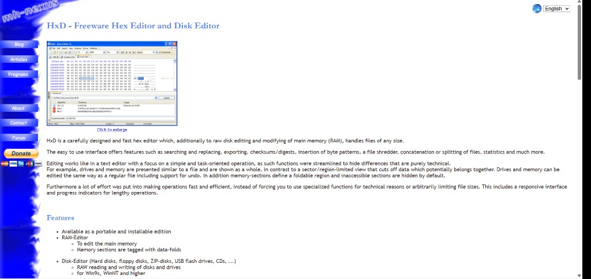
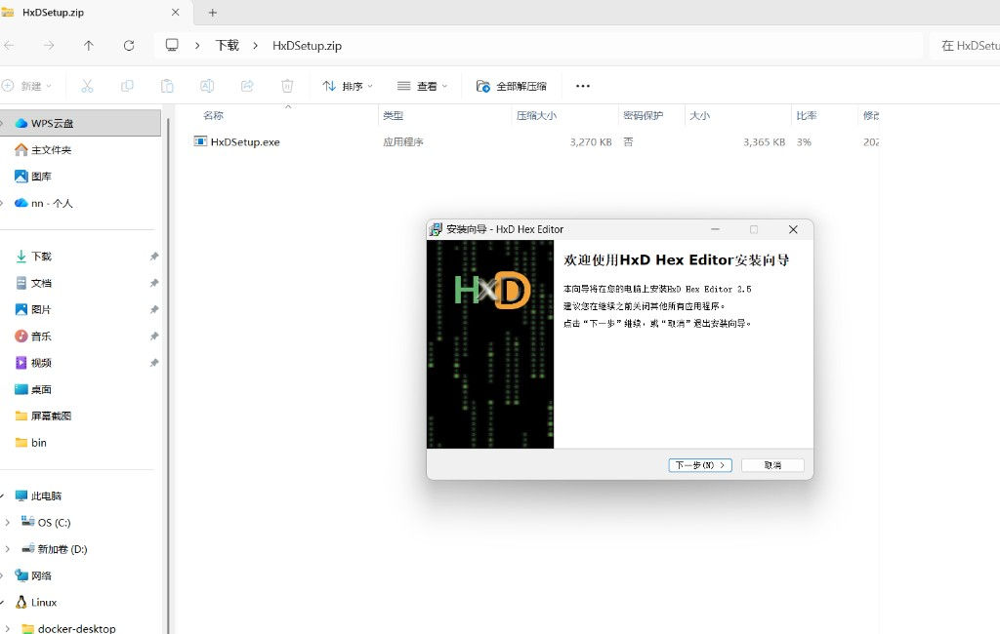

## 准备工具 · HxD

| 工具 | 用途 | 推荐 |
|------|------|------|
| **十六进制编辑器** | 新建/编辑软盘映像、写入机器码 | [HxD](https://mh-nexus.de/en/hxd/)（免费）· WinHex |
| **QEMU** | 把 `.img` 当 A: 软盘启动 | 见 [section-1.1.5](./section-1.1.5-QEMU安装与运行.md) · [SETUP.md](../../SETUP.md) |

*HxD：偏移 + 十六进制 + ASCII 三栏；支持软盘映像 raw 读写、校验和。*

**下载：** [mh-nexus.de/en/hxd](https://mh-nexus.de/en/hxd/) → **Downloads** → 选 **Chinese (Simplified)** 或 **Portable Edition**（2.3+ 便携版无需管理员权限，可放 U 盘）。当前页列出版本 **2.5.0.0**（约 3.2 MiB），HTTPS 下载；可用页内 SHA-1 / SHA-512 校验。

### 安装 HxD（Windows）

1. 解压 `HxDSetup.zip`，运行 **`HxDSetup.exe`** → 欢迎页点 **下一步**。

2. **选择安装路径** 时，把默认 `C:\Program Files\...` 改到 **非系统盘 + 纯英文路径**，例如 `D:\DevTools\HxD`。
3. 其余步骤 **一路默认** → 完成安装。

> **便携版：** 解压到 `D:\DevTools\HxD\` 直接运行 `HxD.exe`，跳过安装向导。

← [1.1 导读](./section-1.1-先动手操作.md) · 下一步 [1.1.2 HxD 界面与新建映像](./section-1.1.2-HxD界面与新建映像.md)
