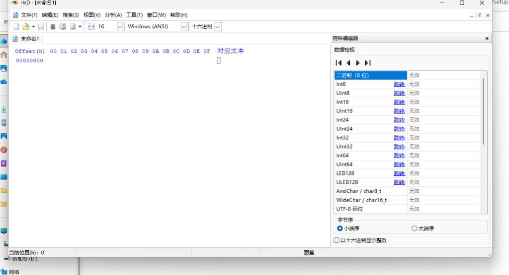
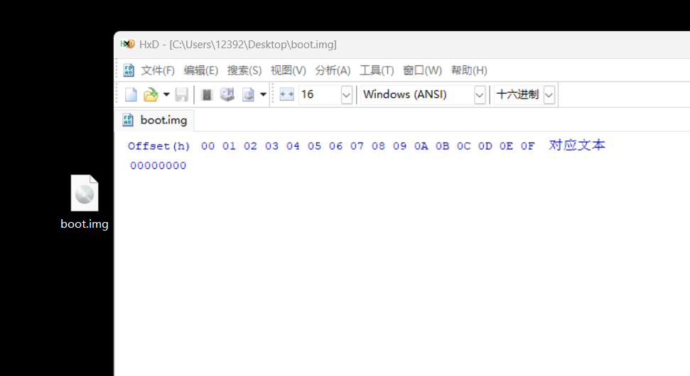

## HxD 界面 · 新建 1.44 MB 映像

### 认界面

首次打开是空白标签页 **「未命名 1」**，三栏布局：

| 区域 | 作用 |
|------|------|
| **偏移 (h)** 左列 | **只读标尺** — 告诉你「当前行从文件哪个地址开始」；**不是文件内容，不要输入、不要改** |
| **中间 00–0F** | **这才是文件里的字节** — 点击这里输入十六进制 |
| **对应文本** 右列 | 字节的 ANSI 显示（`hello, world` 会出现在这里） |
| **数据检视** 右侧 | 当前光标处按 Int8/UInt16 等解释；**字节序选小端序**（x86） |

> **易混点：** 左侧 **`00000000`** 是地址标签；**第一个要改的字节** 是该行 **`00` 列下、偏移 0 的那一个格子**，应填 **`EB`**，不是在偏移列里填数。

状态栏 **当前位置 (h): 0** 表示光标在文件开头。

### 新建软盘映像

| 属性 | 值 |
|------|-----|
| 文件名 | `boot.img` 或 `helloos.img` |
| 大小 | **1,474,560 字节** = **1440 KB** = 标准 1.44 MB 软盘 |

**做法 A（推荐 · 桌面建文件 + 扩大小）**

1. 桌面 **右键** → **新建** → **文本文档**
2. 重命名 → **`boot.img`**（改后缀时 Windows 提示有风险 → **是**）
3. **HxD** 打开 `boot.img`

4. **`Ctrl+E`** → 新大小 **`1474560`** → 确定（默认 `00` 填充）

**做法 B：** `文件` → `新建` → **`1474560`** → 全 `00` → 另存为 `boot.img`。

整盘先铺满 `00` 很正常；**只有前 512 字节引导扇区决定能否 boot**。长期路径建议 `D:\haribote\boot.img`（纯英文、无空格）。

← [1.1.1 准备工具](./section-1.1.1-准备工具-HxD.md) · 下一步 [1.1.3 写入机器码](./section-1.1.3-写入引导扇区机器码.md)
