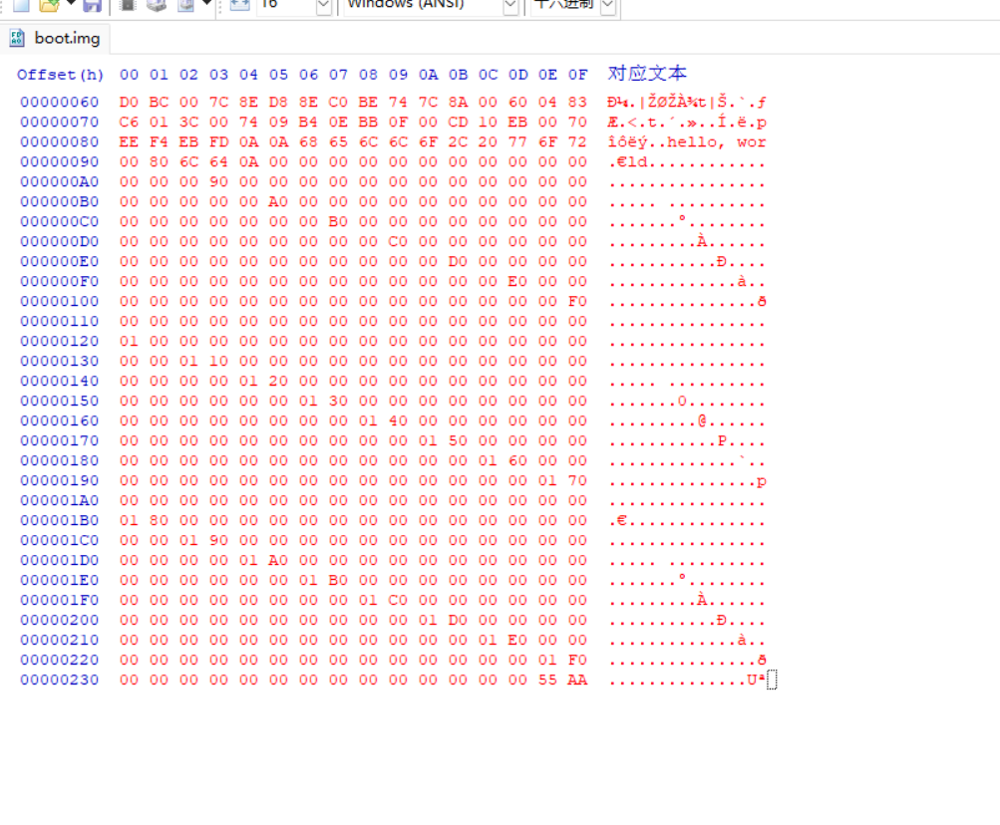

## 启动签名 `55 AA` · 粘贴自检

引导扇区 **固定 512 字节**（偏移 `0x000`–`0x1FF`）。

| 位置 | 必须是什么 |
|------|------------|
| 字节 **510–511**（**`0x1FE`–`0x1FF`**） | **`55 AA`** |

少了这两个字节，BIOS **不会** 认可引导扇区 —— 映像再大也会黑屏或「非系统盘」。

> **`55 AA` 不在 1.44 MB 文件物理末尾**，只在 **第一个扇区** 的 **`0x1FE`**。

HxD：**`Ctrl+G` → `1FE`** 确认；文本栏可能显示为 **`Uª`**。

### 粘贴后自检

| 检查 | 应出现 |
|------|--------|
| `Ctrl+G` → **`0`** | **`EB 4E 90`** |
| `Ctrl+G` → **`76`** 或右侧文本栏 | **`hello, world`** |
| `Ctrl+G` → **`1FE`** | **`55 AA`** |
| ~`0x84`–`0x1FD` | 理想为全 **`00`**（与 [helloos-boot-sector.hex](../code/helloos-boot-sector.hex) 一致） |

**快速自检：** 大小 **1,440 KB** · **`EB 4E 90`** · **`55 AA` @ `1FE`** · 含 **`hello, world`**。

← [1.1.3 写入机器码](./section-1.1.3-写入引导扇区机器码.md) · 下一步 [1.1.5 QEMU](./section-1.1.5-QEMU安装与运行.md)
