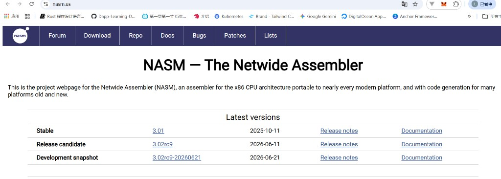
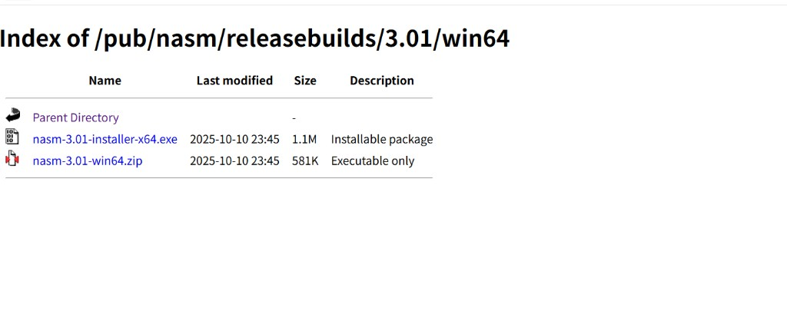

## ③ 初次体验汇编程序

手敲 **数十万** 个 0/1 或 hex：**慢、易错、不可维护** → 引入 **汇编语言**。

```
helloos.asm  ──nasm -f bin──►  ipl.bin / helloos.img  ──QEMU──►  hello, world
```

| 步骤 | 工具 | 产出 |
|------|------|------|
| 写源码 | **VS Code + NASM 扩展**（[Day 2 §2.1](../../day-02-asm-makefile/notes/section-2.1-介绍文本编辑器.md#安装-nasm-语法高亮vs-code-扩展)） | **`helloos.asm`** |
| 汇编 | **`nasm -f bin helloos.asm -o ipl.bin`** | **512 B** 引导扇区 |
| 运行 | **QEMU** | 屏幕打印 `hello, world` |

> **工具链：** VS Code 写 **`.asm`** → **NASM** 编译 → **Makefile** 拼映像 → **QEMU** 启动。详见 [TOOLCHAIN.md](../../TOOLCHAIN.md) 与 [day-02 code](../../day-02-asm-makefile/code/)。

### NASM 常用命令

| 命令 | 作用 |
|------|------|
| `nasm -f bin helloos.asm -o ipl.bin` | 汇编 → **512 B** `ipl.bin` |
| `nasm -f bin helloos.asm -o ipl.bin -l helloos.lst` | 同上，并生成 **列表文件** 对照 hex |

**`-f bin` 必加：** NASM 若用 **`-f elf`** 会出带程序头/段信息的目标文件，需 **`ld` 链接** — **BIOS 引导扇区用不了**。**`-f bin`** 才输出 **无头裸 `.bin`**（平铺机器码，纯二进制），后面才能拼 **1.44 MB 映像** 并用 **QEMU** 启动。详见 [TOOLCHAIN.md · `.bin` 是什么？](../../TOOLCHAIN.md#bin-是什么-f-bin-vs-f-elf-vs-img)。

**笔 vs 编译器：** 编辑器只产出 **给人看的 `.asm` 文本**；**`nasm.exe`** 才把它译成 **机器二进制** — 详见 [Day 2 §2.1 · 编辑器 vs NASM](../../day-02-asm-makefile/notes/section-2.1-介绍文本编辑器.md#编辑器-vs-nasm笔和编译器分工不同)。

**要点：** 汇编是 **机器码的可读别名** — 一条 `MOV` 对应固定字节序列；**NASM 负责编码和布局**，你负责 **逻辑**。

---

### 安装 NASM

安装官网 **NASM** 即可编译 `.asm` 源码。

**官网：** [nasm.us](https://www.nasm.us/)



| 步骤 | 操作 |
|------|------|
| 1 | 顶部 **Download**，或首页 **Stable** 行的版本号（如 **`3.01`**）— **不要选 RC / Development snapshot** |
| 2 | 进入 **`…/releasebuilds/3.01/win64/`** 下载页（64 位 Windows） |
| 3 | 点 **`nasm-3.01-installer-x64.exe`**（Installable package，约 1.1 MB）— **推荐**，一路下一步安装 |
| 4 | 安装时勾选 **Add to PATH**（若用 zip 便携版需自己解压并把目录加入 Path） |
| 5 | **新开** cmd / PowerShell → `nasm -v`，应看到 `NASM version 3.01 …` |



| 文件 | 说明 | 建议 |
|------|------|------|
| **`nasm-3.01-installer-x64.exe`** | 安装包，自动写 PATH | **选这个** |
| `nasm-3.01-win64.zip` | 仅 `nasm.exe`，无安装向导 | 便携/手动配置时用 |

**包管理器（可选）：**

| 系统 | 命令 |
|------|------|
| Windows（Chocolatey） | `choco install nasm` |
| macOS（Homebrew） | `brew install nasm` |
| MSYS2 | `pacman -S nasm` |

**装好后立刻试编译：**

```cmd
cd day-02-asm-makefile\code
make
```

或手动：

```cmd
nasm -f bin helloos.asm -o ipl.bin -l helloos.lst
```

**`-f bin`** = 输出 **512 B 纯二进制**引导扇区。再用 [1.1.5 QEMU](./section-1.1.5-QEMU安装与运行.md) 启动验证 `hello, world`。

> **GCC / Make / 完整 Day 0 环境**（Day 3 起才刚需）→ [SETUP.md](../../SETUP.md)；**本节只要 NASM + QEMU 就能完成 Day 1 汇编实验**。

---

### 汇编 ↔ 机器码：昨天那些 hex 从哪来

Day 1 在 HxD 里手敲的 **`B8 00 00`、`CD 10`、`55 AA`** 不是随机数，而是 **CPU 能执行的指令编码**。汇编语言只是把同一串字节写成人话。

#### 通用规则（16 位实模式 · Intel 语法）

| 规则 | 说明 |
|------|------|
| **一条指令 = 若干字节** | 第 1 字节多为 **操作码 (opcode)**；后面可能跟 **操作数** |
| **立即数小端序** | 多字节数 **低字节在前**：`0x0123` 存成 `23 01` |
| **汇编器只做翻译** | **NASM** 读 **`.asm`** 源码，编码助记符并处理偏移，输出与手工 **相同字节** |

#### 入门例子：`MOV AX, 立即数`

`AX` 是 16 位通用寄存器。把立即数搬进 `AX` 的 opcode 固定为 **`B8`**，后面跟 **2 字节** 立即数（小端）：

| 汇编 | 机器码（hex） | 拆解 |
|------|---------------|------|
| `MOV AX, 0` | `B8 00 00` | `B8` + 立即数 `0x0000` |
| `MOV AX, 0x0123` | **`B8 23 01`** | `B8` + 立即数 `0x0123` → 低字节 `23`，高字节 `01` |
| `MOV AX, 0x7C00` | `B8 00 7C` | 栈指针常用值，后面 helloos 里会出现 |

> **对照昨天：** 引导扇区偏移 **`0x050`** 起的第一个指令就是 **`B8 00 00`** — 即 `MOV AX, 0`，不是「三个无关数字」，而是 **一条完整指令**。

#### helloos 程序段：汇编与 hex 一一对应

下面把 [1.1.3 写入的机器码](./section-1.1.3-写入引导扇区机器码.md) 与典型 `helloos.asm` 逻辑对照（偏移 **`0x050`–`0x073`** 为代码，**`0x076`** 起为字符串）：

| 偏移 | 机器码 | 汇编（大意） | 作用 |
|------|--------|--------------|------|
| `0x050` | `B8 00 00` | `MOV AX, 0` | 段寄存器初始化基数 |
| `0x053` | `8E D0` | `MOV SS, AX` | 栈段 = 0 |
| `0x055` | `BC 00 7C` | `MOV SP, 0x7C00` | 栈顶指向引导扇区附近 |
| `0x058` | `8E D8` | `MOV DS, AX` | 数据段 = 0 |
| `0x05A` | `8E C0` | `MOV ES, AX` | 附加段 = 0 |
| `0x05C` | `BE 74 7C` | `MOV SI, 0x7C74` | 字符串地址（= 段内偏移 `0x74`） |
| `0x05F` | `8A 04` | `MOV AL, [SI]` | 取当前字符 |
| `0x061` | `83 C6 01` | `ADD SI, 1` | 指向下一个字符 |
| `0x064` | `3C 00` | `CMP AL, 0` | 是否字符串结尾 |
| `0x066` | `74 09` | `JE …` | 结束则跳出循环 |
| `0x068` | `B4 0E` | `MOV AH, 0x0E` | BIOS  teletype 功能号 |
| `0x06A` | `BB 0F 00` | `MOV BX, 0x000F` | 白色文字属性 |
| `0x06D` | `CD 10` | `INT 0x10` | **BIOS 视频中断** — 打印 `AL` 中字符 |
| `0x06F` | `EB EE` | `JMP …` | 回到取字符处（循环） |
| `0x071` | `F4` | `HLT` | 停机 |
| `0x072` | `EB FD` | `JMP …` | 死循环，防止跑飞 |
| `0x076` | `68 65 6C …` | `DB "hello, world", …` | 数据，不是指令 |

用汇编写同一段，HxD 里 **`0x050` 起的字节应完全一致** — 这就是「汇编入门」要验证的事。

#### 用 NASM 列表文件核对（推荐）

```bash
nasm -f bin helloos.asm -o helloos.img -l helloos.lst
```

**`helloos.lst`**：左边是 **偏移 + 机器码**，右边是 **源码行**。例如：

```
0050  B80000          MOV     AX,0
0053  8ED0            MOV     SS,AX
...
```

**用法：** 打开 `.lst`，把 **`0050` 行起的 hex** 与 [HELLOOS_HEX_REFERENCE](../../HELLOOS_HEX_REFERENCE.md) 或 HxD 里昨天敲的内容 **逐字节对比**。一致 → 说明汇编器只是在替你「打字」。

#### 和后面章节的联系

| 现在（Day 1 实模式） | 后面（保护模式起） |
|----------------------|-------------------|
| 段寄存器 ×16 + 偏移寻址 | **GDT** 描述段基址与限长 |
| 手写 / 汇编 **固定 opcode** | 仍是指令编码，但寻址模式更多 |
| `INT 0x10` 调 BIOS | 逐步改用 **自有 API / 驱动** |

先建立 **「一行汇编 ↔ 一串 hex」** 的肌肉记忆，后面读 **`helloos.asm`**、GDT 加载、模式切换时，看到 `MOV` / `JMP` / `LGDT` 就不会只把它们当成「魔法咒语」。

---

### 最小 `helloos.asm` 骨架（示意）

```nasm
        ORG     0x7C00          ; BIOS 加载地址 — NASM 据此算标签/偏移

        MOV     AX, 0
        MOV     SS, AX
        MOV     SP, 0x7C00
        ; … 打印循环（jmp / mov / int 由 NASM 编码，不用手写 EB/CD…）…
        TIMES   510-($-$$) DB 0 ; 自动填 0 到第 510 字节（$=当前位置，$$=段起点）
        DB      0x55, 0xAA      ; 引导签名 — 对应 HxD 偏移 0x1FE
```

`ORG 0x7C00` + `TIMES`：**段地址、填零、512 字节布局** 都写在源码里，编译一行搞定 — 这是和昨天 HxD 最大的区别。

---

**对照资料：** [HELLOOS_HEX_REFERENCE.md](../../HELLOOS_HEX_REFERENCE.md) · [code/helloos-boot-sector.hex](../code/helloos-boot-sector.hex)

← [1.2 究竟做了些什么](./section-1.2-究竟做了些什么.md) · 下一步 [1.4 加工润色](./section-1.4-加工润色.md)
