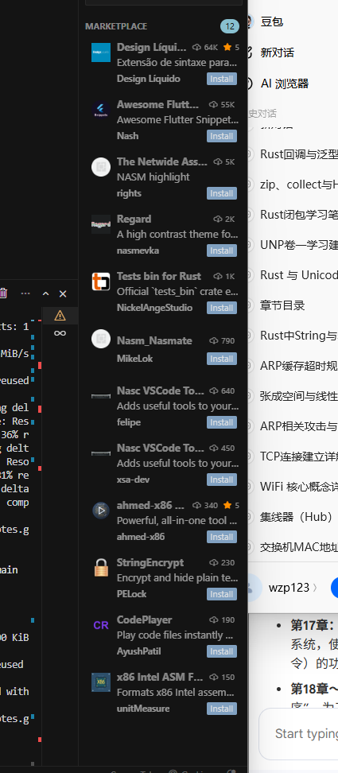

## ① 介绍文本编辑器（写代码用）

### 大白话 · NASM 与 `.asm`

两件事分开记就够了：

| 名字 | 是什么 | 你要怎么做 |
|------|--------|------------|
| **NASM** | **汇编器（工具）** — 把人写的汇编 **翻译成** CPU 能执行的二进制 | 命令行装 **`nasm.exe`**，用 **`nasm -f bin … -o …`** |
| **`.asm`** | **源码后缀** — 纯文本汇编 | 在 VS Code 里写，如 [code/helloos.asm](../code/helloos.asm) |

```
helloos.asm（VS Code 写）  ──nasm -f bin──►  ipl.bin（512 B）──make──►  helloos.img ──QEMU──►  启动
```

**一条口诀：** **NASM 是工具；`.asm` 是源码文件名。**

---

原书这里说的 **文本编辑器**，指的是 **写程序源码** 的工具 — **不是** Word、记事本里写作文、写笔记那种「文档编辑器」。

| | 文档向 | **代码向（本章要用的）** |
|---|--------|-------------------------|
| 典型用途 | 笔记、报告 | **汇编 `.asm`、C、Makefile、以后 Rust / Solidity** |
| 你需要的能力 | 排版 | **语法高亮、缩进、多文件工程、终端一体** |
| 例子 | 记事本写 `.txt` | **VS Code 写 `helloos.asm`** |

整条 HFT 学习链里，**源码都落在同一类编辑器里写** — 自制 OS 的汇编、后面的 **Rust 量化**、链上 **Solidity**，只是语言插件不同，编辑器可以一直是 **VS Code**（或 Cursor）。

---

### 编辑器 vs NASM：笔和编译器（分工不同）

**文本编辑器是写代码的「笔」；NASM 是把汇编译成机器能执行的「编译器/汇编器」** — 二者各干一件事，不能互相替代。

| | **文本编辑器**（VS Code / 记事本） | **NASM**（`nasm.exe`） |
|---|-----------------------------------|------------------------|
| 角色 | **写字** — 存成 **给人看的文本** | **翻译** — 产出 **给 CPU 看的二进制** |
| 输入 | 你敲的 `MOV`、`JMP`… | **`helloos.asm`** 等 **`.asm`** 源码 |
| 输出 | 仍是 **文本**（`.asm`） | **纯二进制**（`.bin` / `.img`） |
| 能否启动 OS？ | **不能** — 模拟器读不懂源码 | **能** — 二进制才是引导扇区机器码 |

**一条完整链路（以引导扇区为例）：**

```
VS Code / 记事本          nasm -f bin              QEMU
     │                        │                      │
     ▼                        ▼                      ▼
 helloos.asm            ipl.bin / os-image.bin      当成 OS 引导镜像
（给人看的文本）              （nasm -f bin 纯二进制）
```

举例：你在 **VS Code** 里写好 **`helloos.asm`**，文件里仍是 **`MOV AX, 0` 这类字符** — CPU 和 QEMU **都认不得**。必须再跑 **`nasm -f bin helloos.asm -o ipl.bin`**，得到 **不含字母、只有字节的纯二进制**，再拼进 **1.44 MB** 映像后，QEMU 才能 **`-fda …`** 启动。

| 源码（本仓库） | NASM 产出 | 给 QEMU 用 |
|--------------|-----------|------------|
| **`helloos.asm`** | **`ipl.bin`**（**512 B**） | 嵌入 **`helloos.img`** 后再 `-fda`（见 [Day 1 §1.4](../day-01-boot-asm/notes/section-1.4-加工润色.md)） |

**和下面两节的对应关系：**

- **本节 + VS Code 扩展** → 管好 **「笔」**（写、改、高亮 `helloos.asm`）
- **[Day 1 §1.3 · 装 NASM](../day-01-boot-asm/notes/section-1.3-初次体验汇编程序.md#安装-nasm)** → 装好 **「汇编器」**（`nasm.exe`）
- **[2.4 Makefile](./section-2.4-Makefile-入门.md)** → 一条命令 **`make`** 自动 **nasm 翻译 + 拼映像**

> **VS Code 里也有叫 NASM 的扩展** — 那是 **编辑时语法高亮**，不是 `nasm.exe`；别和命令行汇编器搞混（见下方安装步骤）。

---

### 推荐：VS Code（新手友好）

**为什么不用 Windows 记事本写汇编？**

| 记事本 | VS Code |
|--------|---------|
| 无语法高亮，`MOV` / `JMP` 一片黑 | 装插件后 **指令、标签、注释** 分色 |
| TAB 宽度难统一，Makefile 易踩坑 | 可设 **Tab = 4 空格** 或显示 Tab |
| 无工程感，文件一多就乱 | **文件夹打开整个工程**，侧边栏跳转 |
| 要和 cmd 来回切 | **内置终端** `` Ctrl+` ``，`make` 直接在同窗口敲 |

**汇编高亮：** 装一个 **NASM / x86 汇编** 扩展后，打开 `helloos.asm` 即可看到 **指令、寄存器、标签、注释** 分色 — 见下方 **安装步骤**。

#### 安装 NASM 语法高亮（VS Code 扩展）

| 步骤 | 操作 |
|------|------|
| 1 | 打开 VS Code（或 Cursor） |
| 2 | 左侧点 **扩展** 图标，或按 **`Ctrl+Shift+X`** |
| 3 | 搜索框输入 **`NASM`** |
| 4 | 安装 **The Netwide Assembler**（描述里写 *NASM highlight*）→ 见下方 **选哪个** |
| 5 | 打开 **`helloos.asm`** — 若已打开，关掉再开一次或 **`Ctrl+Shift+P` → Reload Window** |



#### 选哪个？（搜 `NASM` 时别装错）

市场里会混进 **Flutter、主题、Rust** 等无关项（作者名带 *nash*、*nas* 也会冒出来）— **只装汇编高亮** 即可。

| 推荐 | 扩展名（截图里） | 说明 |
|------|------------------|------|
| **首选** | **The Netwide Assembler** | 全称就是 NASM 官方名；描述 **NASM highlight** — **装这个** |
| 备选 | **Nasm_Nasmate** | 同样面向 NASM，首选装不上再试 |
| 备选 | **Design Líquido**（下载量高） | 通用汇编语法；若上面两个没有，可试 |

**不要装（与 helloos.asm 无关）：**

| 截图里会出现 | 原因 |
|--------------|------|
| Awesome Flutter Snippets | 作者叫 Nash，**不是 NASM** |
| Regard | **主题**，不是语法 |
| Tests bin for Rust | **Rust 测试**，不是汇编高亮 |
| StringEncrypt / CodePlayer | 与写引导扇区无关 |
| x86 Intel ASM Formatter | **格式化**工具，不能替代高亮（以后可选） |

**仍搜不到时：** 改搜 **`x86 assembly`**，装 **x86 and x86_64 Assembly**（Intel 语法，兼容本课 `MOV AX, …`）。

**装好后应看到：** `MOV`、`JMP`、`ORG` 等着色；`;` 注释变灰/绿；`0x7C00` 等常数与字符串 `"hello, world"` 与指令颜色不同。

**若 `.asm` 仍无高亮：** 右下角语言模式点 **纯文本** → 选 **NASM** 或 **Assembly**；或在 `settings.json` 里加：

```json
"files.associations": {
  "*.asm": "asm-intel"
}
```

（具体 `"asm-intel"` / `"nasm"` 取值取决于你装的扩展；选扩展文档里推荐的 ID 即可。）

> **区分两个「NASM」：** [Day 1 §1.3](../day-01-boot-asm/notes/section-1.3-初次体验汇编程序.md#安装-nasm) 装的是 **命令行汇编器 `nasm.exe`**（编译用）；本节是 **VS Code 扩展**（编辑时高亮用）— 两个都要，各干一件事。

**本仓库还用它写：**

- `helloos.asm`、`Makefile`（[2.4](./section-2.4-Makefile-入门.md)）
- 各 Day 的 `notes/*.md`（Markdown 内置支持）
- 日后 **Rust**（`rust-analyzer`）、**Solidity**（官方 Solidity 扩展）— 同一套环境延伸即可

> **Cursor** 基于 VS Code，用法相同；下文统称 **VS Code**。

---

### 可选：Vim

作者也提到 **Vim** — 终端里高效改文本，**快捷键多、学习曲线陡**。  
**喜欢折腾、愿意背命令** 可以用；**想快速上手自制 OS** 建议先 **VS Code**，不必一开始就啃 Vim。

| | VS Code | Vim |
|---|---------|-----|
| 上手 | 菜单 + 鼠标 + 少量快捷键 | 大量 **模式 + 快捷键** |
| 汇编高亮 | 装 NASM 插件 | 装语法文件 / 插件 |
| 适合 | **新手、本课程默认** | 熟手、全键盘流 |

---

### 和「写笔记」分开（心里有数即可）

| 放哪 | 用什么 |
|------|--------|
| **仓库笔记**（`notes/section-*.md`） | VS Code / Obsidian / 任意 Markdown 编辑器 |
| **可编译源码**（`.asm`、`.c`、`Makefile`、`Cargo.toml`…） | **VS Code + 对应语言插件** |

笔记可以当文档读；**能 `nasm` / `make` / `cargo build` 的文件** 请在代码编辑器里维护，避免「存成 UTF-8 BOM + 错误换行」导致编译怪错。

---

### 自检

- [ ] 已安装 **VS Code**（或 Cursor）
- [ ] 已装 **NASM / 汇编** 相关扩展，`helloos.asm` 有语法高亮
- [ ] 能用 **文件 → 打开文件夹** 打开 Day 1 工程目录
- [ ] 知道：**文本编辑器 = 写代码的笔**；**NASM = 把 `.asm` 译成二进制**；**QEMU 只认二进制映像**

---

← [Day 1](../day-01-boot-asm/) · 下一步 [2.2 继续开发](./section-2.2-继续开发.md)
