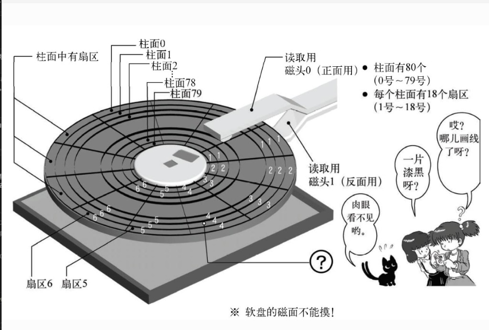

## ①.2 软盘 CHS 结构与读盘范围



原书要点（肉眼看不见，但 **`INT 0x13` 必须按这套编号寻址**）：

| 标注 | 含义 |
|------|------|
| **柱面 0 ~ 79** | 共 **80** 个柱面（同心磁道，由外向内编号） |
| **扇区 1 ~ 18** | 每个柱面 **18** 个扇区（径向切分，每扇区 **512 B**） |
| **磁头 0 / 1** | **H0** 正面、**H1** 反面，各对应盘片一面 |

| 术语 | 定义 | 本书参数 |
|------|------|----------|
| **柱面 Cylinder (C)** | 盘片上一组同心磁道，从外向内编号 | 共 80 柱面；IPL 读 **前 10 柱面（C0~C9）** |
| **磁头 Head (H)** | 软盘正反面各 1 个读写头 | **H0** 正面、**H1** 反面 |
| **扇区 Sector (S)** | 单条磁道上最小读写单元 | 每磁道 **18** 扇区，每扇区 **512 B** |

整盘容量：**80 × 2 × 18 × 512 = 1,474,560 B（1.44 MB）**，与 Day 2 的 `helloos.img` 大小一致。

**10 柱面（bootpack 加载范围）：**

```text
10 × 2 磁头 × 18 扇区 × 512 B = 184,320 B ≈ 180 KB
```

读盘顺序（物理寻址）：**同柱面 H0 扇区 1→18 → H1 扇区 1→18 → 柱面 +1**，直到 C9 结束。IPL 自身占 **S1**，OS 数据从 **S2** 开始读。

#### 启动数据流（与 CHS 对应）

```text
软盘 C0-H0-S1（ipl.bin 512B）
    → BIOS 载入内存 0x7C00 运行
        ↓ INT 0x13 循环读盘
软盘 C0-H0-S2 ~ C9-H1-S18（10 柱面）
    → 载入内存 0x8200 起（bootpack，约 180KB）
        ↓ JMP 0x8200
nasmhead / bootpack 继续启动（见 [§3.2](./section-3.2-纸娃娃操作系统.md)）
```

寄存器与 CHS 的对应（读盘时）：**`CH`=柱面、`DH`=磁头、`CL`=扇区** — 见 [§3.1.3](./section-3.1.3-INT0x13与ipl代码拆解.md)。

---

← [§3.1.1 IPL 与镜像布局](./section-3.1.1-IPL-bootpack与镜像布局.md) · [§3.1.3 INT 0x13 →](./section-3.1.3-INT0x13与ipl代码拆解.md)
