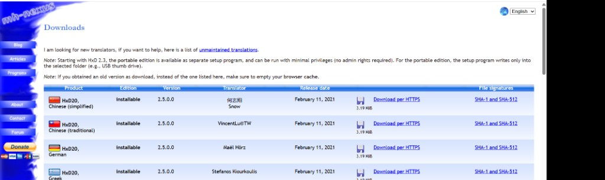

## ① 先动手操作 · 二进制编辑器写系统

**整本书最有冲击力的环节：** 不用编译器、不用 IDE、不用 C/汇编，只靠 **十六进制编辑器 + QEMU**，手工写出能 boot 的 `hello, world`。

**要带走的体感：** 操作系统不是魔法 —— 就是 **BIOS 加载到内存、按顺序执行的一段二进制流**。后面学汇编、写引导扇区，都是在给这个过程做 **结构化封装**；这一步先把体感焊死。

---

### 准备工具

| 工具 | 用途 | 推荐 |
|------|------|------|
| **十六进制编辑器** | 新建/编辑软盘映像、写入机器码 | [HxD](https://mh-nexus.de/en/hxd/)（免费）· WinHex |
| **QEMU** | 把 `.img` 当 A: 软盘启动 | `qemu-system-i386`（见 [SETUP.md](../../SETUP.md)） |


*HxD：偏移 + 十六进制 + ASCII 三栏；支持软盘映像 raw 读写、校验和。*

**下载：** [mh-nexus.de/en/hxd](https://mh-nexus.de/en/hxd/) → **Downloads** → 选 **Chinese (Simplified)** 或 **Portable Edition**（2.3+ 便携版无需管理员权限，可放 U 盘）。当前页列出版本 **2.5.0.0**（约 3.2 MiB），HTTPS 下载；可用页内 SHA-1 / SHA-512 校验。



#### 安装 HxD（Windows）

1. 解压 `HxDSetup.zip`，运行 **`HxDSetup.exe`** → 欢迎页点 **下一步**。


2. **选择安装路径** 时，把默认 `C:\Program Files\...` 改到 **非系统盘 + 纯英文路径**，例如：

   ```
   D:\DevTools\HxD
   ```

   避免写镜像、保存工程时碰 **UAC / 系统目录权限**；也与全书「路径禁中文、禁空格」一致。

3. 其余步骤 **一路默认** → 完成安装 → 打开 HxD，即可开始下方 **1.44 MB 软盘映像** 实验。

> **便携版：** 若下载的是 Portable Edition，解压到 `D:\DevTools\HxD\` 直接运行 `HxD.exe`，跳过安装向导。

全程 **不需要 tolset / nask** —— 本节故意与编译器绝缘。

---

### 动手步骤（HxD + QEMU）

#### 0. 打开 HxD · 认界面

首次打开是空白标签页 **「未命名 1」**，三栏布局：

| 区域 | 作用 |
|------|------|
| **偏移 (h)** 左列 | 当前行起始地址（从 `00000000` 起） |
| **中间 00–0F** | 每行 16 字节的十六进制 |
| **对应文本** 右列 | 字节的 ANSI 显示（`hello, world` 会出现在这里） |
| **数据检视** 右侧 | 当前光标处按 Int8/UInt16 等解释；**字节序选小端序**（x86） |


状态栏 **当前位置 (h): 0** 表示光标在文件开头 —— 等会儿从这里写入引导扇区。

#### 1. 新建 1.44 MB 空白软盘映像

| 属性 | 值 |
|------|-----|
| 文件名 | `boot.img` 或 `helloos.img` |
| 大小 | **1,474,560 字节** = **1440 KB** = 标准 1.44 MB 软盘 |

**做法 A（推荐 · 桌面建文件 + 扩大小）**

1. 桌面 **右键** → **新建** → **文本文档**
2. 重命名：`新建文本文档.txt` → **`boot.img`**（改后缀时 Windows 提示有风险 → **是**）
3. **HxD** 打开 `boot.img`（标题栏会显示完整路径）


4. 按 **`Ctrl+E`**（或菜单 **编辑 → 更改大小**）→ 新大小填 **`1474560`** → 确定  
5. 空白软盘映像就绪（默认以 `00` 填充）

**做法 B：** `文件` → `新建` → 大小 **`1474560`** → 全 `00` → 另存为 `boot.img`。

整盘先铺满 `00` 很正常；**只有前 512 字节引导扇区 + 末尾 `55 AA` 决定能否 boot**，其余扇区 Day 1 可保持为零。

> **路径：** 练手可用桌面 `boot.img`；长期建议移到纯英文目录如 `D:\DevTools\haribote\helloos.img`，与 tolset 工程放一起。

这就是笔记里说的 **「1440KB 标准软盘」** —— 后文 Day 2 的 Makefile 拼出来的也是这个尺寸。

#### 2. 从偏移 0 写入原书机器码

打开原书 **Day 1 附表**（或 tolset 里 `helloos` 工程对照用的那张 **完整十六进制表**），从 **第一个字节（偏移 0x00000000）** 起，把整表 **粘贴进映像**。

不必手敲每一个字节；关键是 **位置对、长度对**。若手敲练手，至少认清这几处：

| 偏移 | 十六进制 | 含义 |
|------|----------|------|
| `0x000` | `EB 4E 90` | **短跳转** 跳过 FAT12 参数区 + **NOP** 填充 |
| `0x003` 起 | `48 45 4C 4C 4F 49 50 4C` | ASCII **`HELLOIPL`**（8 字节 OEM 名，非显示内容） |
| 程序区 | `B8 00 00 8E D0 …` | 初始化段寄存器、循环 `INT 0x10` 打印字符 |
| 数据区 | `68 65 6C 6C 6F 2C 20 77 6F 72 6C 64` | 字符串 **`hello, world`** |
| **`0x1FE`** | **`55 AA`** | **引导扇区签名** — BIOS 认盘的硬条件 |

开头你看到的 `EB 4E 90` 后面紧跟的是 **磁盘格式参数**（`HELLOIPL`、每扇区 512、FAT12 等），不是直接显示 Hello；**屏幕上那句 `hello, world` 在更后面的数据区**，用 `INT 0x10` 打出来。

#### 3. 死磕最后两字节：`55 AA`

引导扇区 **固定 512 字节**（偏移 `0x000`–`0x1FF`）。

| 位置 | 必须是什么 |
|------|------------|
| 字节 **510–511**（即 **`0x1FE`–`0x1FF`**） | **`55 AA`** |

少了这两个字节，BIOS **不会** 把该扇区当可引导盘 —— 映像再大也只会黑屏或报非系统盘。

HxD 底部状态栏可看 **当前偏移**；跳转到 `1FE` 确认是 `55 AA`。

#### 4. 保存并用 QEMU 启动

**不必装 VMware / VirtualBox** — Day 1 只需 **QEMU** 模拟 **x86 PC 从软盘 A: 引导**。

##### 获取 QEMU（官方 Windows 安装包）

1. 打开 [qemu.org/download#windows](https://www.qemu.org/download/#windows)（页顶选 **Windows** 标签）


2. 找到 **「Stefan Weil provides binaries…」** 一句 → 点红色链接 **`64-bit`** → 进入镜像站 [qemu.weilnetz.de/w64/](https://qemu.weilnetz.de/w64/)


3. 在列表 **最下方**（或按日期选最新）下载 **`qemu-w64-setup-YYYYMMDD.exe`**，例如 `qemu-w64-setup-20230501.exe`（约 190 MB）。**不必**进年份子目录，直接下页面底部的 setup 安装包即可。

| 推荐 | 说明 |
|------|------|
| **`qemu-w64-setup`** | 官方预编译 **安装程序**，双击安装即可 |
| **tolset 自带** | 原书 `z_tools` 里常有 `qemu-system-i386.exe`，后续 Day 与 make 联用 |

**不必走 MSYS2 / `pacman` 那条路** — 那是给开发环境用的；手工 `boot.img` 只要上面的 **setup 安装包**。

**不要**用来源不明的「QEMU 便携版」第三方打包。

**安装：** 在「下载」里双击刚下好的 **`qemu-w64-setup-….exe`** → 路径建议 **`D:\DevTools\QEMU`** → 勾选 **Add to PATH**（若有）→ 完成。新开 **cmd**：

```cmd
qemu-system-i386 --version
```

未加 PATH 时，默认路径多为 `C:\Program Files\qemu\qemu-system-i386.exe`。

##### 运行 boot.img

1. HxD **`Ctrl+S`** 保存好已写入机器码的 **`boot.img`**
2. 打开 **cmd**，进入映像所在目录（例：桌面）：

```cmd
cd C:\Users\12392\Desktop
qemu-system-i386 -fda boot.img
```

若未加 PATH，用完整路径，例如：

```cmd
D:\DevTools\qemu\qemu-system-i386.exe -fda C:\Users\12392\Desktop\boot.img
```

**`-fda`** = 把该文件挂到虚拟机的 **A: 软驱** —— 等价于三十年前电脑开机读你那张 1.44 MB 软盘。

**预期：** 弹出 QEMU 窗口，BIOS 自检后出现 **`hello, world`**。

> **这一刻在发生什么：** 不是「运行某个 .exe 程序」，而是 **模拟一台老 PC 把引导扇区载入 `0x7C00` 并按字节执行**。屏幕上每个字符，都是你写进 `boot.img` 的机器码通过 `INT 0x10` 打出来的 —— **相当于亲手给一台老电脑装了自己写的系统。**

关窗口或 QEMU 里 **`Ctrl+Alt+G`** 释放鼠标后关闭即可；改完 hex 再跑同一行命令，重启极快，适合 Day 1 反复试错。

---

### 这一步在学什么（不是学「写代码」）

```
电源 ON
  → BIOS 自检
  → 读软盘 0 号扇区 512 B 到内存 0x7C00
  → 检查末尾 55 AA
  → 从 0x7C00 开始当机器码执行
  → INT 0x10 往显存打字符
  → 你看到 hello, world
```

| 误区 | 正解 |
|------|------|
| 「OS 一定要 C / 百万行内核」 | 第一天只有 **几百字节机器码 + 签名** |
| 「映像要很复杂」 | **1.44 MB** 里绝大部分可以是 `00`；**前 512 B** 决定能否 boot |
| 「和汇编无关」 | 下一节 [1.3](./section-1.3-初次体验汇编程序.md) 用 **同一份逻辑** 的 `helloos.nas` 生成 **相同 img** |

**HFT 直觉：** 再复杂的网关/引擎，冷启动时 CPU 读的也是 **Flash/磁盘上的原始字节** — 没有魔法。后面 [1.2](./section-1.2-究竟做了些什么.md) 把「你敲的 hex = 机器指令」说透。

---

### 自检

- [ ] 映像大小 **1,474,560 B**
- [ ] 偏移 **`0x1FE`** 为 **`55 AA`**
- [ ] QEMU `-fda` 启动可见 **`hello, world`**
- [ ] 能用自己的话说明：**BIOS 为何只认 512 B 扇区末尾签名**

---

### 常见坑

| 现象 | 原因 |
|------|------|
| 非系统盘 / 不启动 | 缺 **`55 AA`**，或引导区未写在 **偏移 0** |
| 乱码或崩溃 | 十六进制 **错位**（粘贴时漏字节、奇数位） |
| 黑屏无输出 | 映像太小；或未用 **`-fda`** 挂软盘 |
| 路径含中文 | 个别工具读写失败 — 工程放纯英文路径 |

---
