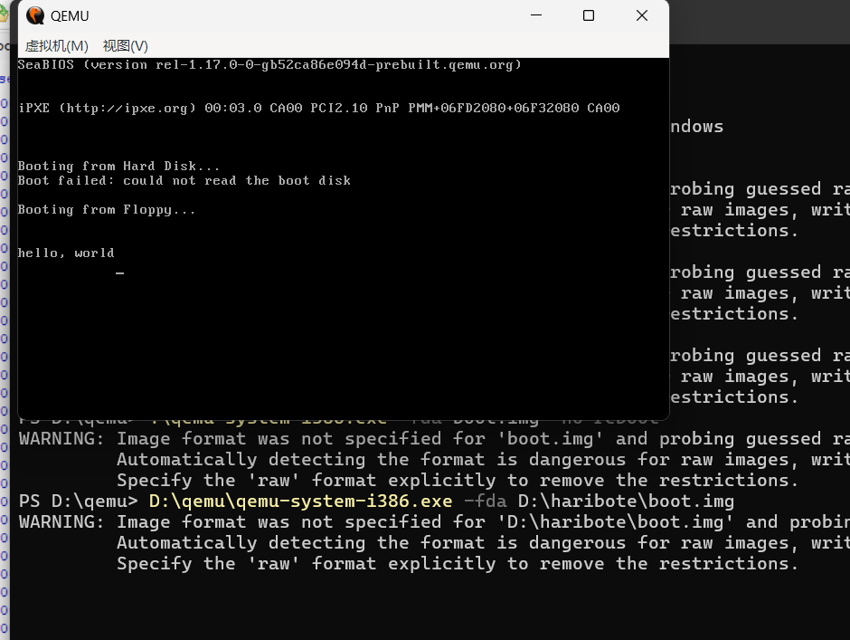

## QEMU 安装与运行

**不必装 VMware / VirtualBox** — Day 1 只需 **QEMU** 模拟 **x86 PC 从软盘 A: 引导**。

### 获取（官方 `qemu-w64-setup`）

1. [qemu.org/download#windows](https://www.qemu.org/download/#windows) → **Windows** 标签


2. **Stefan Weil provides binaries…** → **`64-bit`** → [qemu.weilnetz.de/w64/](https://qemu.weilnetz.de/w64/)


3. 下载最新 **`qemu-w64-setup-YYYYMMDD.exe`**（约 190 MB）。**跳过 MSYS2 / pacman** 段落。

**不要**用来源不明的「QEMU 便携版」第三方打包。

### 安装

双击 setup → **Choose Install Location** → 建议 **`D:\qemu`**（约 1.1 GB）→ 勾选 **Add to PATH**（若有）→ **Install**。


新开 cmd：`qemu-system-i386 --version`

### 运行 boot.img

1. HxD **`Ctrl+S`**；确认 **1440 KB**（`1474560` B）
2. PowerShell：

```cmd
D:\qemu\qemu-system-i386.exe -fda D:\haribote\boot.img
```

**`-fda`** = 虚拟 **A: 软驱**（软盘），**不是**硬盘。

预期屏幕顺序：

```
Booting from Hard Disk...
Boot failed: could not read the boot disk    ← 正常，见下
Booting from Floppy...
hello, world
```



> **`Boot failed: could not read the boot disk` 不是 Day 1 失败。** BIOS 默认 **先试硬盘 (C:)**；本命令只挂了 **软盘 A:**，没挂可启动硬盘，所以硬盘那一步 **必然** 报这句，然后才会 **`Booting from Floppy...`**。  
> **成功标志** 是软盘那行之后出现 **`hello, world`** —— 说明 `boot.img` 引导扇区被读入 **`0x7C00`** 并执行了。

`WARNING: image format was not specified` 可忽略。关窗口用 **`Ctrl+Alt+G`** 释放鼠标。

← [1.1.4 启动签名](./section-1.1.4-启动签名与自检.md) · 下一步 [1.1.6 排错](./section-1.1.6-启动链路与排错.md)
