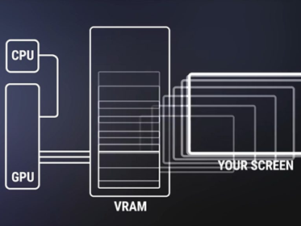

## ① 用 C 写入显存与位运算 · 从黑屏到条纹

Day 3 用 **`HariMain` + `for`** 把 **`0xA0000`** 填 **0** → **全黑**，证明 C 已在 **32 位保护模式** 下跑起来（见 [Day 3 bootpack.c](../../day-03-32bit-c/code/sec-3.4-bootpack-asm-and-c/bootpack.c) · [§3.2 纸娃娃 OS](../../day-03-32bit-c/notes/section-3.2-纸娃娃操作系统.md)）。

Day 4 **第一节** 只做一件事：**用 C 直接写显存（VRAM）**，先 **整屏变白**，再用 **位运算** 画出 **黑白相间条纹** —— 证明 **GUI 的第一块砖** 是「往 framebuffer 写字节」，不是调 Windows API。

---

### 承前：图形模式已经切好了

| 项目 | 值 | 谁做的 |
|------|-----|--------|
| **分辨率** | **320 × 200** | nasmhead 里 **`INT 0x10`, AX=0x0013`（§3.2） |
| **色深** | **8 bit/像素**（256 个 **色号索引** 0–255） | 模式 0x13 |
| **显存映射** | 从 **`0xA0000`** 起连续 **64000** 字节 | CPU 32 位平坦地址空间 |
| **Day 3 验收** | 全屏 **黑**（色号 **0**） | `HariMain` 里 `vram[i] = 0` |

> **8 位模式写进 VRAM 的不是 RGB**，而是 **调色板索引**。索引 **0** 默认偏黑、**15** 默认偏白（具体 RGB 由调色板决定 — [§4.3](./section-4.3-调色板Palette与色号.md) 再细调）。

---

### 显存模型：CPU → VRAM → 屏幕



| 图中块 | 在纸娃娃 OS（模式 0x13）里对应什么 |
|--------|-----------------------------------|
| **CPU** | **`HariMain` 里的 `for`** — 你的 C 代码往内存写字节 |
| **GPU** | 早期 VGA **没有** 现代意义上的 GPU 驱动；可理解为 **显示控制器** 在后台扫描显存（你不用写 GPU 程序） |
| **VRAM** | 地址 **`0xA0000` 起 64000 字节** — 每字节 1 像素色号 |
| **YOUR SCREEN** | QEMU / 显示器 — **硬件按 VRAM 内容逐行刷新** 成画面 |

**和 Day 3 / Day 4 代码的对应：**

```text
HariMain:  p[i] = 0 或 15     ← CPU 写 VRAM（图中 CPU → VRAM）
           ↓
VGA 扫描 0xA0000 …           ← VRAM → 屏幕（图中 VRAM → YOUR SCREEN）
           ↓
QEMU 窗口：黑屏 / 白屏 / 条纹
```

所以 **改一个内存地址 = 改一个像素** — 这就是 **memory-mapped framebuffer**。  
现代 PC 仍类似：只是地址、分辨率、色深不同，且常有独立 GPU 做 3D；**Day 4 先掌握「写 VRAM = 改屏」** 即可。

---

### VRAM 长什么样

```text
物理地址
0xA0000  ──► [像素(0,0)][像素(1,0)]…[像素(319,0)]   ← 第 0 行，320 字节
0xA0140  ──► [像素(0,1)]…                          ← 第 1 行
   …
0xA0000 + 319 + 199*320  ──► 最后一个像素 (319, 199)

每字节 = 1 个像素 = 1 个色号（0~255）
总字节 = 320 × 200 = 64_000
```

| 概念 | 公式 / 说明 |
|------|-------------|
| **线性下标 `i`** | `i = y * 320 + x`（`x`: 0~319，`y`: 0~199） |
| **指针写法** | `p[y * 320 + x] = color` |
| **与 Day 3 对比** | Day 3 用 `for (i = 0; i < 320*200; i++)` — 等价于按行扫完整块显存 |

---

### 第一步：`for` 循环 — 整屏变白

在 **`HariMain`** 里，把 Day 3 的 **`vram[i] = 0`** 改成写 **15**（原书常用默认白）：

```c
void HariMain(void)
{
    int i;
    char *p = (char *) 0xa0000;   /* VRAM 起点；§4.2 专讲指针 */

    for (i = 0; i < 320 * 200; i++) {
        p[i] = 15;                /* 每个像素：色号 15 → 白 */
    }

    for (;;) {
        io_hlt();
    }
}
```

| 问题 | 答案 |
|------|------|
| 为何是 **`char *`**？ | 每像素 **1 字节** ↔ 汇编 **`MOV BYTE [addr], al`** |
| 为何 **`0xa0000`**？ | VGA 模式 0x13 的 **framebuffer 固定映射**（与 nasmhead 切模式配套） |
| QEMU 里看到什么？ | **整屏白** — 比 Day 3 黑屏多一步：**你在选颜色** |

建议加 **`volatile`**（硬件内存可能被设备/缓存语义特殊对待）：

```c
volatile char *p = (volatile char *) 0xa0000;
```

Day 3 的 [bootpack.c](../../day-03-32bit-c/code/sec-3.4-bootpack-asm-and-c/bootpack.c) 已用 `volatile unsigned char *` — 同一思路。

---

### 第二步：位运算 — 黑白条纹

整屏一种颜色不够「像程序画出来的」。原书用 **AND / OR / XOR** 按 **坐标或下标的某几位** 决定黑还是白。

#### 三种运算在显存里干什么

| 运算 | C 写法 | 典型用途（本节） |
|------|--------|------------------|
| **AND `&`** | `x & 8` | **取某几位** — 看周期、算条纹周期 |
| **OR `\|`** | `c \| mask` | **合并** 位域（后续图层/标志常用） |
| **XOR `^`** | `x ^ y` | **翻转/交替** — 棋盘格、简单图案 |

#### 竖条纹（按 x 的某位交替）

```c
void HariMain(void)
{
    int x, y;
    char *p = (char *) 0xa0000;

    for (y = 0; y < 200; y++) {
        for (x = 0; x < 320; x++) {
            if ((x & 8) == 0) {       /* x 的第 3 位为 0 → 一段宽 8 像素 */
                p[y * 320 + x] = 15;  /* 白 */
            } else {
                p[y * 320 + x] = 0;   /* 黑 */
            }
        }
    }

    for (;;) { io_hlt(); }
}
```

- **`x & 8`**：只保留 **bit3**；为 0 时 x ∈ {0..7, 16..23, …} → **8 像素宽** 的竖条。
- 改 **`x & 4`** 或 **`x & 16`** → 条纹 **更密 / 更疏**（玩位掩码）。

#### 横条纹（按 y 的某位）

```c
if ((y & 4) == 0)
    p[y * 320 + x] = 15;
else
    p[y * 320 + x] = 0;
```

#### 单循环 + 下标 `i`（与 Day 3 风格一致）

```c
for (i = 0; i < 320 * 200; i++) {
    if ((i & 0x100) == 0)   /* 按地址某位分区 — 体会「位 = 模式」 */
        p[i] = 15;
    else
        p[i] = 0;
}
```

---

### 从 Day 3 黑屏到 Day 4 条纹（改动最小）

```text
Day 3  HariMain:  vram[i] = 0;              → 黑屏
       ↓ 只改赋值逻辑
Day 4  步骤 1:    p[i] = 15;               → 白屏
       步骤 2:    if ((x&8)==0) p[…]=15/0  → 条纹
```

**汇编搭台、C 唱戏** 不变：仍由 [nasmhead](../../day-03-32bit-c/code/sec-3.4-bootpack-asm-and-c/nasmhead.asm) 切 VGA + 32 位；**只有 `bootpack.c` 里 `HariMain` 的循环在变**。

---

### C 写显存 ↔ 汇编写内存

| 汇编（32 位保护模式） | C |
|----------------------|---|
| `MOV AL, 15` | `char c = 15;` |
| `MOV EBX, 0xA0000` | `char *p = (char *)0xa0000;` |
| `MOV BYTE [EBX + ECX], AL` | `p[i] = c;` 或 `*p = c; p++;` |

**本节先用 `p[i]`**；下一节 [§4.2 指针](./section-4.2-挑战并理解指针.md) 把 **`char *`、cast、`*p`** 讲透。

---

### 常见坑

| 现象 | 原因 |
|------|------|
| 还是黑屏 | 没切模式 0x13（nasmhead 未跑）或写错地址（写成 `0xB8000` 文本缓冲） |
| 花屏 / 乱闪 | 循环越界（`i >= 320*200`）或 bootpack 被踩栈 |
| 条纹不对 | 位掩码写错 — 用 **`&` 后再和 0 比**，不要和 1 比错成「奇偶 x」 |
| 颜色不是想的白/黑 | 8 位是 **索引** — 要真 RGB 需 [§4.3 调色板](./section-4.3-调色板Palette与色号.md) |

---

### HFT / 系统编程对照

| OS 课（本节） | 别处同类思路 |
|---------------|--------------|
| **`0xA0000` + 字节写** | **`mmap` 映射的 framebuffer / 共享内存区** |
| **`for` 扫 64KB 显存** | 扫 **ring buffer、行情快照数组** — 注意 **cache line、对齐** |
| **AND 取位做条纹** | **位图标志位**、订单状态 mask、**无锁结构** 里的 bit field |
| **少做无意义全屏扫** | HFT：**热路径少 touch 大数组**；OS 后面用 **矩形裁剪**（§4.5）只改一块 |

---

### 自检

- [ ] 说清 **VRAM 起始 `0xA0000`**、**320×200**、**偏移 `y*320+x`**
- [ ] 能解释 **写 15 与写 0** 分别对应什么现象（白 / 黑）
- [ ] 用 **`(x & 8) == 0`** 口述 **8 像素宽竖条** 怎么来的
- [ ] 知道 **8 位像素 = 调色板索引**，不是 RGB 三元组（§4.3 续）
- [ ] 对照 Day 3 [bootpack.c](../../day-03-32bit-c/code/sec-3.4-bootpack-asm-and-c/bootpack.c) 说出 **只改 C、不改 nasmhead** 即可从黑屏到条纹

---

← [Day 4 README](../README.md) · [Day 3 §3.2 图形模式](../../day-03-32bit-c/notes/section-3.2-纸娃娃操作系统.md) · [§4.2 指针 →](./section-4.2-挑战并理解指针.md)
