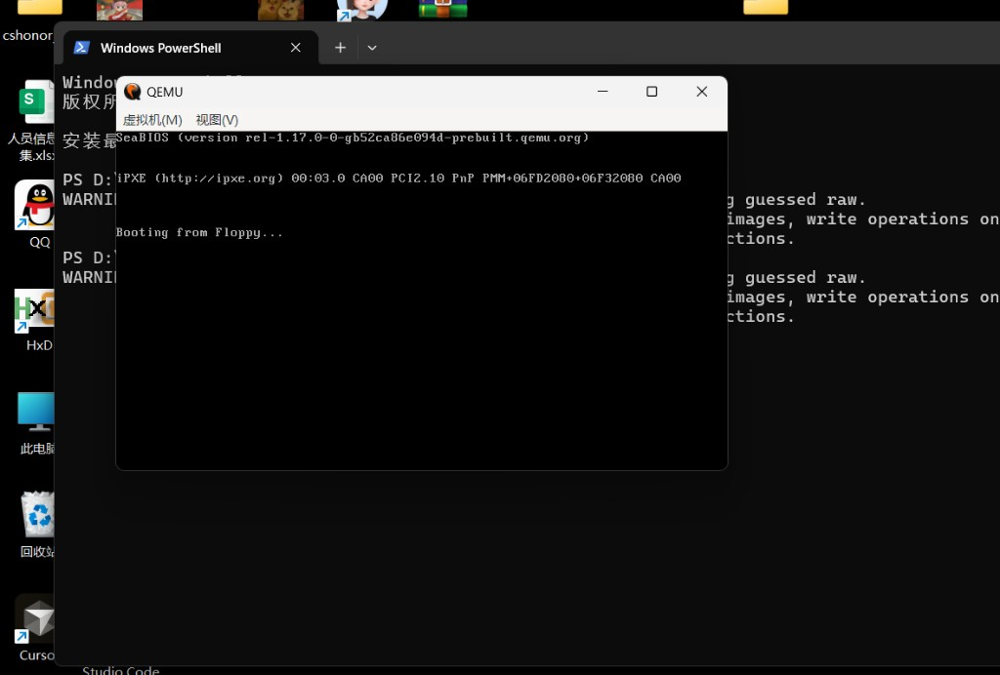

## 启动链路 · 错误报告 · 排错

### 这一步在学什么

```
电源 ON → BIOS 自检 → 读软盘 0 号扇区 512 B 到 0x7C00
  → 检查 0x1FE 处 55 AA → 从 0x7C00 执行机器码
  → INT 0x10 打字符 → hello, world
```

| 误区 | 正解 |
|------|------|
| 「OS 一定要 C / 百万行内核」 | 第一天只有 **几百字节机器码 + 签名** |
| 「映像要很复杂」 | **1.44 MB** 里绝大部分是 `00`；**前 512 B** 决定 boot |
| 「和汇编无关」 | [1.3](./section-1.3-初次体验汇编程序.md) 用 `helloos.nas` 生成 **相同 img** |

**HFT 直觉：** 冷启动时 CPU 读的就是 **磁盘上的原始字节**。详见 [1.2](./section-1.2-究竟做了些什么.md)。

---

### Day 1 错误报告条目（规范）

| # | 错误类型 | 现象 / 根因 | 正确做法 |
|---|----------|-------------|----------|
| **1** | **镜像容量不达标** | 只写 **512 B** 或 `Ctrl+E` 填错（如 **`21448608`**），未到 **1,474,560 B** | **`Ctrl+E` → `1474560`**；或复制 [helloos.img](../code/helloos.img) |
| **2** | **启动标记位置错误** | **`55 AA`** 写在 **1.44 MB 文件末尾**，而非扇区末 | **`Ctrl+G` → `1FE`** |
| **3** | **开头被偏移干扰** | 把 **偏移 (h) 标尺** 当内容；文件仍以 **`00`** 开头 | hex 区第一格 **`EB 4E 90`**；偏移列只读 |

---

### QEMU 卡在 `Booting from Floppy...`



BIOS 已认盘（`0x1FE` 有 `55 AA`），但 **引导代码未正确执行**：

| 检查项 | 正确值 | 常见错误 |
|--------|--------|----------|
| 文件大小 | **1,474,560 B** | **`21448608`** 等 |
| 偏移 `0x000` | **`EB 4E 90`** | 开头 **`00 00`** |
| 字符串 | 含 **`hello, world`** | 错位后消失 |
| `0x1FE` | **`55 AA`** | 仅有签名、代码错 |

**做法 A（推荐 · 一键替换）：**

```powershell
New-Item -ItemType Directory -Force D:\haribote | Out-Null
Copy-Item -Force "<本仓库>\09-system-low-level-hands-on\08-1-30days-os\day-01-boot-asm\code\helloos.img" "D:\haribote\boot.img"
D:\qemu\qemu-system-i386.exe -fda D:\haribote\boot.img -boot a
```

**勿**把 `boot.img` 放在 `D:\qemu\` 安装目录。

**做法 B（手工）：** [HELLOOS_HEX_REFERENCE.md](../../HELLOOS_HEX_REFERENCE.md) + [helloos-boot-sector.hex](../code/helloos-boot-sector.hex)

| 现象 | 原因 |
|------|------|
| 非系统盘 | 缺 **`55 AA`** 或引导区不在偏移 **0** |
| 卡住无字 | 见上表 |
| 乱码 | hex **错位** |
| 路径含中文 | 工具读写失败 |

← [1.1.5 QEMU](./section-1.1.5-QEMU安装与运行.md) · [1.1 导读](./section-1.1-先动手操作.md) · 下一节 [1.2](./section-1.2-究竟做了些什么.md)
